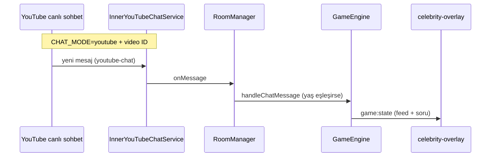

# YouTube sohbet — nasıl çalışır?

## Özet

| Konu | Davranış |
|------|----------|
| **Mesaj okuma** | `CHAT_MODE=youtube` → `youtube-chat` paketi, canlı **video ID** ile (Google Data API kotası harcanmaz) |
| **Panel testi** | İsteğe bağlı `CHAT_MODE=mock` — varsayılan **youtube / InnerChat** |
| **Bağlantı** | Admin → canlı yayın linki → **Sohbete bağlan** → video ID kaydedilir |
| **Ne zaman dinler?** | Oyun **Başlat** sonrası (`active` / kısa süre `winner`) |
| **Doğru bilenler listesi** | En fazla **7** kişi (varsayılan), `.env` → `PUZZLE_FEED_MAX=10` ile artırılır |
| **Bot YouTube’a yazar mı?** | Hayır — «Bot görünen adı» yalnızca panel günlüğü / şablon metinleri içindir |
| **Bot görünen adı** | YouTube hesabı değil; `config.botName` (ör. YouTube Bulmacalari) |
| **Photo Quiz + ünlü yaş** | Mod Photo Quiz kalır; sorular ünlü CSV ise sohbette **yaş** okunur (1/2 oylama değil) |

## Akış (ünlü yaş / bulmaca)

1. `.env` içinde `CHAT_MODE=youtube` (yerel test için `mock` da olur).
2. Admin’de **Sohbet botu** → canlı yayın URL’si (`watch?v=...` veya `youtu.be/...`).
3. **Sohbete bağlan** → `POST /api/rooms/{oda}/youtube/connect`.
4. **Başlat** → sohbet dinleme modu `live` olur.
5. İzleyici sohbette yaş yazar → doğruysa puan + overlay listesine girer.

## Doğru bilenler — kaç kişi?

- Sunucu `playerScores` tutar; overlay’de **puanı olan** en yüksek N kişi gösterilir.
- Varsayılan **N = 7** (`PUZZLE_FEED_MAX` ile 3–20 arası değiştirilebilir).
- Aynı kişi birden fazla soruda doğru bilirse puanları **toplanır**, sıralama buna göre.

## Test (YouTube olmadan)

1. `CHAT_MODE=mock` ile sunucuyu başlatın veya Lab **sahte sohbet** kullanın.
2. `http://127.0.0.1:3847/play/celebrity-quiz-lab.html?room=ODA_ID`
3. **Demo başlat** → aktif ünlünün yaşını yazın → sağdaki listede görünür.

## Test (gerçek YouTube)

1. `.env`: `CHAT_MODE=youtube`
2. Sunucuyu yeniden başlatın (`baslat.cmd`)
3. Admin → giriş → canlı yayın linki → **Sohbete bağlan** → **Başlat**
4. OBS: `http://127.0.0.1:3847/celebrity-overlay?room=ODA_ID`

## InnerChat canlı tap (geçici debug)

Admin → **Sohbet botu** → **InnerChat canlı tap** kutusu: YouTube’dan gelen son mesajlar (yazar, metin, video ID, oyun sonucu).

- Sunucuda varsayılan **açık** (`INNER_CHAT_TAP=1` veya satır yok). Kapatmak: `INNER_CHAT_TAP=0` + restart.
- Liste yalnızca **Başlat** sonrası (`pollingMode: live`) dolar.
- API: `GET /api/rooms/{oda}/inner-chat/tap`, `POST .../inner-chat/tap/clear`

## API

- `GET /api/app/chat-info` — mod, feed limiti (giriş yok)
- `GET /api/rooms/{id}/status` — oyun + YouTube durumu
- `POST /api/rooms/{id}/questions/import-celebrities` — ünlü CSV
- `POST /api/rooms/{id}/youtube/connect` — `{ "streamUrl": "https://..." }`
